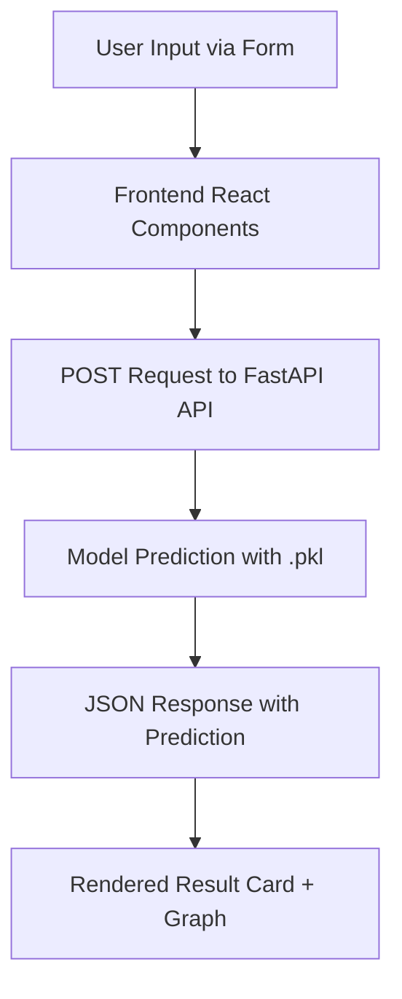
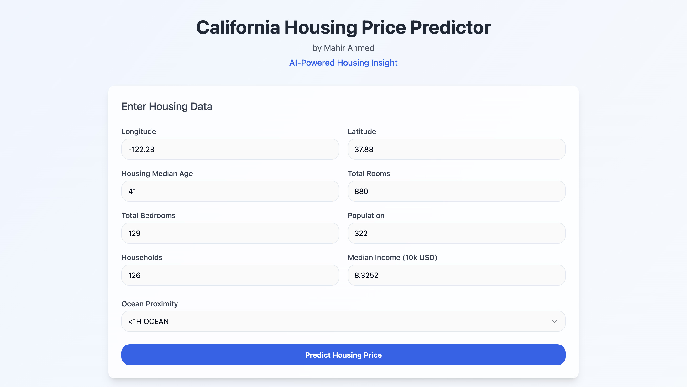
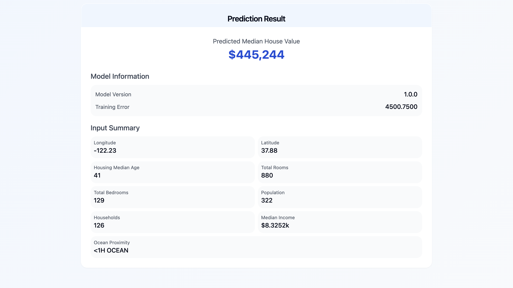

# 🏡 California Housing Price Predictor

> **Project Author**: Mahir Ahmed
> **Type**: Full-stack AI-powered web application
> **Tech Stack**: FastAPI, React, Vite, TailwindCSS, scikit-learn, GitHub LFS

---

## 🚀 Overview

This project is a **real-time housing price prediction platform** built with production-grade architecture. It uses a trained **Random Forest Regressor** model to estimate median house values in California based on demographic and geographic input features. It features:

* 📊 Machine Learning model deployed through a FastAPI backend
* 🔗 Fully connected React + TypeScript frontend built with Vite
* 🏢 TailwindCSS UI for sleek, responsive design
* ✨ Support for model transparency, prediction confidence, and PDF downloads
* ✅ GitHub LFS integration for managing large `.pkl` model files

---

## 📂 Project Structure

```plaintext
CaliforniaHousingPredictor/
├── backend/                 # FastAPI backend with model API
│   ├── app/                # Modularized API and model logic
│   └── ml_model/           # Trained model (.pkl)
├── frontend/               # Vite + React + Tailwind frontend
├── california_housing.ipynb # EDA and model training notebook
├── housing.csv             # Raw dataset (optional)
├── requirements.txt        # Backend dependencies
├── .gitattributes          # Git LFS tracking for .pkl
├── .gitignore              # Ignore cache, nodes, etc.
└── README.md               # This file
```

---

## 🔄 Full Stack Flow



---

## 📅 Features

| Feature                 | Description                                     |
| ----------------------- | ----------------------------------------------- |
| 🎯 Real-Time Prediction | Predicts house prices using 8+ input features   |
| 🌐 API Integration      | `/api/v1/predict` route returns structured JSON |
| 🎓 Model Transparency   | Returns training MSE and version                |
| 📖 Download Support     | Attach and download papers (PDF format)         |
| 🚀 GitHub LFS           | Handles `.pkl` files >100MB gracefully          |
| 🚧 Error Boundaries     | Full loading/error/reset states implemented     |

---

## 📄 Project Whitepaper

You can read the full technical report detailing the model, system architecture, and deployment pipeline here:

➡️ [California Housing Price Prediction Paper (PDF)](./CaliforniaHousingPaper.pdf)


## 📕 Backend (FastAPI)

### Install & Run:

```bash
cd backend
pip install -r requirements.txt
uvicorn app.main:app --reload
```

### Predict Route:

* **Endpoint**: `POST /api/v1/predict`
* **Request Body**: JSON with 9 features (e.g., `latitude`, `longitude`, etc.)
* **Response**:

```json
{
  "predicted_median_house_value": 358241.75,
  "input_parameters": { ... },
  "model_info": {
    "version": "1.0.0",
    "training_mse": 4500.75
  }
}
```

---

## 🗺 Frontend (React + Vite)

### Install & Run:

```bash
cd frontend
npm install
npm run dev
```

### Features:

* Form-based input with validation
* API call via `housingService.ts`
* Result UI in `PredictionResult.tsx`
* Mock fallback detection and toast alerts

---

## 🌍 Deployment

| Layer     | Platform | URL Example                                   |
| --------- | -------- | --------------------------------------------- |
| Frontend  | Vercel   | `https://california-housing-ui.vercel.app`    |
| Backend   | Render   | `https://california-housing-api.onrender.com` |
| LFS Files | GitHub   | `.pkl` via Git LFS                            |

### 📌 Environment Notes:

* Update `housingService.ts` to use live backend URL
* Configure CORS in `main.py` to allow Vercel domain

---

## 🎓 Model Details

| Property              | Value                     |
| --------------------- | ------------------------- |
| Model Type            | RandomForestRegressor     |
| Hyperparameter Tuning | GridSearchCV              |
| Features Used         | 9 (incl. `median_income`) |
| Target                | `median_house_value`      |
| Training MSE          | \~4500.75                 |

---

## 📚 Dataset

* Original Source: California Housing from [StatLib](https://www.dcc.fc.up.pt/~ltorgo/Regression/cal_housing.html)
* Size: \~20,000 records
* Format: CSV with numerical + categorical data

---

## 🔧 Local Development Checklist

* [x] Model trained & saved via joblib
* [x] FastAPI backend working with `/api/v1/predict`
* [x] React form and output rendering
* [x] CORS, loading, and error states tested
* [x] GitHub LFS enabled and `.pkl` tracked

---

### 🔧 Local Development Setup

To run this project locally, ensure that both the **frontend** and **backend** are served on their respective ports, and update CORS + API paths accordingly.

#### ✅ Backend (FastAPI)
Start the backend server:
```bash
cd backend
uvicorn app.main:app --reload
```
By default, this will be available at:  
`http://127.0.0.1:8000`

#### ✅ Frontend (React + Vite)
Start the frontend dev server:
```bash
cd frontend
npm install
npm run dev
```
This runs at:  
`http://localhost:3000`

#### 🔁 CORS Origins (in `main.py`)
Ensure you allow local development origins:
```python
origins = [
    "http://localhost:3000",
    "http://127.0.0.1:3000"
]
```

#### 🔄 Frontend API URL
In `frontend/src/services/housingService.ts`, update the API call during local dev:
```ts
fetch('http://127.0.0.1:8000/api/v1/predict', {
```

Make sure to revert this to your Render backend URL (`https://your-api.onrender.com/...`) before deploying.


## 📊 Screenshots





---

## 📈 Contact

For questions, feedback, or contributions:

* **Mahir Ahmed**
* [LinkedIn](https://linkedin.com/in/mahirahmed)
* Email: [mahir@email.com](mailto:mahir@email.com)
